# 二叉树中的最大值

- [二叉树中的最大值](#二叉树中的最大值)
  - [题目描述](#题目描述)
  - [解题思路](#解题思路)
    - [代码实现](#代码实现)

## 题目描述

路径 被定义为一条从树中任意节点出发，沿父节点-子节点连接，达到任意节点的序列。同一个节点在一条路径序列中 至多出现一次 。该路径 至少包含一个 节点，且不一定经过根节点。

路径和 是路径中各节点值的总和。

给你一个二叉树的根节点 `root` ，返回其 最大路径和 。

**示例1：**

<div align = center>
    
</div>

```
输入：root = [1,2,3]
输出：6
解释：最优路径是 2 -> 1 -> 3 ，路径和为 2 + 1 + 3 = 6
```

**示例2：**

<div align = center>
    
</div>

```
输入：root = [-10,9,20,null,null,15,7]
输出：42
解释：最优路径是 15 -> 20 -> 7 ，路径和为 15 + 20 + 7 = 42
```

## 解题思路

很显然这是一道树型DP的问题。对于树型DP问题的求解，最难的是递归函数的定义。

对于当前来到的任何一个结点，可能的最长路径都有三种情况。
  1. 左 + 根
  2. 右 + 根
  3. 左 + 右 + 根

<div align = center>
    
</div>

如图所示：很显然，第三种情况是不能进行递归的，因为A结点不能再向上连接任何结点，否侧它就不是一条路径了。根据以上分析，递归的返回方案可以确定，递归返回的应该是 `左 + 根` 与 `右 + 根` 中的最大值。

但注意：`左 + 右 + 根` 的情况也可能得到一个最大的路径长度。为了解决这个问题，我们创建一个全局变量 `max`，用来保存当前最大的路径长度。并且在每次递归时，我们都使用 `左 + 右 + 根` 更新这个最大值。

最后，还有一点需要注意：为了得到最大的路径长度，当子树中的最大路径值为负数时，根节点应该选择抛弃这个路径，因为加上子树中的路径只会让其变小。实现中，将抛弃的路径置为0.

### 代码实现

```cpp
class Solution {
public:
    int maxPathSum(TreeNode* root) {
        dfs(root);
        return max;
    }

    int dfs(TreeNode* root) {
        if(root == nullptr) {
            return 0;
        }
        // 如果子结点的最大路径长度为负，我们将其置为0，表示抛弃这条路径
        int leftMax = std::max(0, dfs(root->left));
        int rightMax = std::max(0, dfs(root->right));
        // 使用 左 + 根 + 右 更新最大值
        max = std::max(max, leftMax + rightMax + root->val);
        // 返回以该结点为头的最大路径
        return root->val + std::max(leftMax, rightMax);
    }

private:
    int max = INT_MIN;
};
```

- 时间复杂度：$O(N)$，因为我们只遍历了N个结点。
- 空间复杂度：$O(\log{N})$，递归实现，函数调用需要使用栈空间，递归的深度为二叉树的高度。