# 32. 最长有效括号

给你一个只包含 `'('` 和 `')'` 的字符串，找出最长有效（格式正确且连续）括号子串的长度。

## Examples

示例1：

```
输入：s = ")()())"
输出：4
解释：最长有效括号子串是 "()()"
```

示例2：

```
输入：s = "()())((()"
输出：4
解释：最长有效括号为"(())"
```

## 解题思路

我们要求解的问题是一个字符串中的最长有效括号子串的长度。

因此，我们将`dp[i]`定义为以 i 为结尾的匹配括号子串的长度。因为字符串只由`'('`和`')'`组成，所以我们可以知道，当`s[i] == '('`时`dp[i]`的值一定为0。

<div align = center>
    
</div>

观察上图，当求解`dp[i]`时，我们需要比对的字符为`s[i]`和`s[j]`，而 j 可以通过        `dp[i - 1]`求出，观察可得`j = i - dp[i - 1] - 1`。

- 如果`s[j] == '('`，也就是 i 和 j 位置的括号相匹配(i位置一定为')'，因为前面已经判断过了)。此时`dp[i]`的值应等于`dp[i - 1] + 2 + d[j - 1]`。

- 否则`dp[i] = 0`。

我们整理一下，`dp[i]`的含义为以`s[i]`结尾的最长匹配括号的长度，对情况进行分类有

- $if(s[i] ==  '(')$
  
  - $dp[i] = 0$

- $else$
  
  - $if(s[i - dp[i - 1] - 1] == '(')$
    
    - $dp[i] = dp[i - 1] + 2 + dp[i - dp[i - 1] - 2]$
  
  - $else$
    
    - $dp[i] = 0$

当然上述的式子必须保证在不越界的前提下。

### 代码实现

```cpp
int longestValidParentheses(string s) {
    if(s.size() == 1) {
        return 0;
    }
    // dp[i]的含义为以i结尾的有效匹配括号的长度
    // s[i] == '('
    //      dp[i] = 0
    // s[i] == ')'
    //      s[i - dp[i - 1] - 1] == '('
    //          dp[i] = dp[i - 1] + 2 + dp[i - dp[i - 1] - 2]
    //          前提是上面的下标都不越界
    //      下标越界或s[i - dp[i - 1] - 1] != '('
    //          dp[i] = 0
    vector<int> dp(s.size(), 0);
    int maxLen = 0;
    for(int i = 1; i < s.size(); ++i) {
        if(s[i] == ')') {
            int index = i - dp[i - 1] - 1; 
            // index不能越界且s[index] == '(' && s[i] == ')'
            if(index >= 0 && s[index] == '(') {
                dp[i] = dp[i - 1] + 2;
                // 防止index - 1越界
                if(index - 1 >= 0) {
                    dp[i] += dp[index - 1];
                }
            }
            if(dp[i] > maxLen) {
                maxLen = dp[i];
            }
        }
    }
    return maxLen;
}
```
